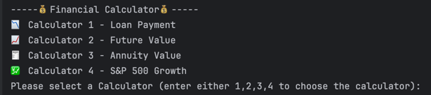

---

## 🧮 Calculator Breakdown
**********
### ️**📲Home screen**

> The user has the ability to choose which calculator they wants to choose corresponding to the 
> number of the calculator
###
>

******

### 1️⃣ **Mortgage Payment Calculator**

> **"How much will my monthly loan payments be, and how much interest will I pay?"**

**Functionality:**
- Calculates the monthly payment for a loan (excluding taxes and insurance)
- Calculates the total interest paid over the life of the loan

**Inputs:**
- Principal (loan amount)
- Annual interest rate (in decimal form, e.g. `7.625%` → `0.07625`)
- Loan term (in years)
###
>
***

### 2️⃣ **Future Value of a One-Time Deposit**

> **"How much will my deposit be worth in the future assuming daily compound interest?"**

**Functionality:**
- Calculates the future value of a one-time investment with daily compounding
- Calculates the total interest earned

**Inputs:**
- Deposit amount (principal)
- Annual interest rate (in decimal form)
- Investment period (in years)
>
---

### 3️⃣ **Present Value of an Ordinary Annuity**

> **"How much do I need to invest today to receive a fixed monthly payout for a number of years?"**

**Functionality:**
- Calculates the present value required to fund an annuity with fixed monthly payouts
- Uses monthly compounding

**Inputs:**
- Monthly payout amount
- Annual interest rate (in decimal form)
- Payout period (in years)
> 

---

### 4️⃣ **Hypothetical S&P 500 Investment Calculator**

> **"What if I had invested in the S&P 500 in year X — how much would that be worth now?"**

**Functionality:**
- Calculates how much a past investment in the S&P 500 would be worth today
- Assumes a constant **10% average nominal annual return**
- Not adjusted for inflation
> 

---

### ⚠️ **Erroneous inputs and error messages** ⚠️

> Choosing a calculator outside of whats available or errenous inputs will result in the following output   
> 

>Entering a value of 0 for interest rate or other inputs may result in the following error as 0 isn't divisible
--------

## 💡 Interesting Logic

futureValueOfInvestment = investedAmount * Math.pow(1+0.1, timeInvested);
> This code is interesting to me because using this I was able to find out how much you can hypothetically make if you invested in a certain year into the S&P500. What was interesting was how simple the equation was. 